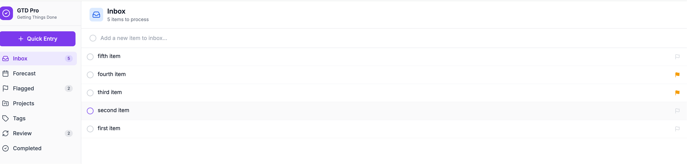
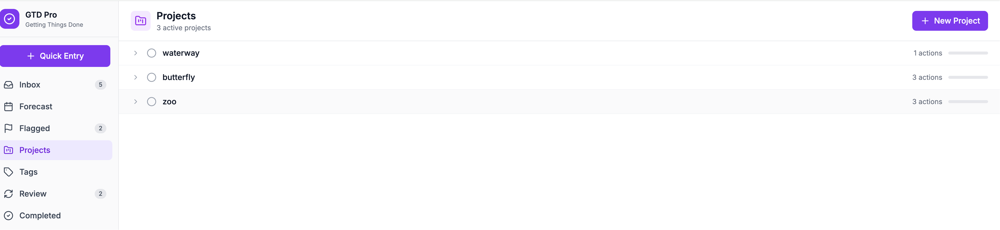
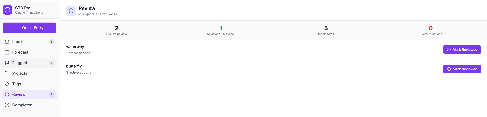

# GTD Pro - Getting Things Done Application

A production-quality GTD (Getting Things Done) task management application inspired by OmniFocus. Built with React, Node.js, and SQLite.

## Screenshots







## Overview

GTD Pro implements David Allen's Getting Things Done methodology with a clean, keyboard-first interface optimized for productivity. The application provides all the core features you'd expect from a professional task management tool:

- **Inbox** - Quick capture thoughts with minimal friction
- **Projects** - Organize multi-step outcomes
- **Actions** - Individual tasks with dates, tags, and flags
- **Tags/Contexts** - Filter by location, tool, energy, or person
- **Perspectives** - Custom filtered views of your data
- **Forecast** - Calendar view of upcoming items
- **Review** - Weekly review workflow for system maintenance

## Technology Stack

### Frontend
- **React 18** with Vite for fast development
- **Tailwind CSS** for styling
- **React Router** for navigation
- **@dnd-kit** for drag and drop
- **date-fns** for date handling
- **Lucide React** for icons

### Backend
- **Node.js** with Express
- **SQLite** with better-sqlite3 for data persistence
- **bcrypt** for password hashing
- **express-session** for authentication

## Quick Start

### Prerequisites
- Node.js 18 or later
- npm

### Setup

1. Navigate to the project directory:
   ```bash
   cd gtd-app
   ```

2. Run the setup script:
   ```bash
   ./init.sh
   ```

3. Start the development servers:
   ```bash
   ./init.sh --start
   ```

4. Open your browser to:
   - Frontend: http://localhost:5173
   - Backend API: http://localhost:3001

### Manual Setup

If you prefer to set up manually:

```bash
# Install frontend dependencies
cd frontend
npm install

# Install backend dependencies
cd ../server
npm install

# Start backend (in one terminal)
cd server
npm run dev

# Start frontend (in another terminal)
cd frontend
npm run dev
```

## Project Structure

```
gtd-app/
├── frontend/
│   ├── src/
│   │   ├── components/      # React components
│   │   │   ├── auth/        # Login, Register pages
│   │   │   ├── common/      # Shared components
│   │   │   ├── layout/      # Sidebar, Header, etc.
│   │   │   ├── actions/     # Action components
│   │   │   ├── perspectives/# Perspective pages
│   │   │   └── settings/    # Settings panel
│   │   ├── contexts/        # React contexts
│   │   ├── hooks/           # Custom hooks
│   │   ├── services/        # API services
│   │   └── utils/           # Utility functions
│   ├── package.json
│   └── vite.config.js
├── server/
│   ├── src/
│   │   ├── routes/          # API endpoints
│   │   ├── middleware/      # Auth, validation
│   │   ├── db/              # Database initialization
│   │   └── index.js         # Server entry point
│   ├── db/
│   │   ├── schema.sql       # Database schema
│   │   └── migrations/      # Future migrations
│   └── package.json
├── feature_list.json        # All features to implement (200+)
├── init.sh                  # Setup script
└── README.md
```

## Feature List

The complete list of features to implement is tracked in `feature_list.json`. This file contains 200+ test cases organized by category:

- **Functional tests** - Core application functionality
- **Style tests** - UI/UX and visual requirements

Each feature includes:
- Description of what to test
- Step-by-step testing instructions
- Pass/fail status

**Important:** Features in this file should NEVER be removed or modified, only marked as passing when implemented.

## GTD Methodology

This application follows the five steps of GTD:

1. **Capture** - Collect everything into the Inbox
2. **Clarify** - Process items: Is it actionable?
3. **Organize** - Put items where they belong
4. **Reflect** - Weekly review to keep system current
5. **Engage** - Choose what to work on

## API Endpoints

### Authentication
- `POST /api/auth/register` - Create account
- `POST /api/auth/login` - Log in
- `POST /api/auth/logout` - Log out
- `GET /api/auth/me` - Get current user

### Inbox
- `GET /api/inbox` - Get inbox items
- `POST /api/inbox` - Quick capture
- `PUT /api/inbox/:id/process` - Process item

### Actions
- `GET /api/actions` - List actions (with filters)
- `POST /api/actions` - Create action
- `PUT /api/actions/:id` - Update action
- `DELETE /api/actions/:id` - Delete action
- `PUT /api/actions/:id/complete` - Complete action
- `PUT /api/actions/:id/flag` - Flag action

### Projects
- `GET /api/projects` - List projects
- `POST /api/projects` - Create project
- `PUT /api/projects/:id` - Update project
- `PUT /api/projects/:id/review` - Mark reviewed

### Tags, Folders, Perspectives
- Similar CRUD endpoints for each resource

### Search
- `GET /api/search?q=query` - Global search
- `GET /api/search/advanced` - Advanced filters

## Keyboard Shortcuts

- `Cmd/Ctrl + N` - Quick entry
- `Cmd/Ctrl + K` - Command palette
- `j/k` - Navigate up/down in lists
- `c` - Complete selected action
- `f` - Flag selected action
- `d` - Open defer date picker
- `t` - Open tag selector
- `Enter` - Open action detail
- `Escape` - Close modal/panel

## Development

### Running Tests
```bash
# Frontend tests
cd frontend
npm test

# Backend tests
cd server
npm test
```

### Code Style
- React functional components with hooks
- Tailwind CSS for styling
- ES modules throughout
- TypeScript-ready structure

## Contributing

This project is being built by autonomous AI agents. Each session:
1. Reads `feature_list.json` to understand what needs to be done
2. Implements features from the list
3. Marks features as passing when complete
4. Commits progress

Future agents should:
- Never remove or modify features in `feature_list.json`
- Work on ONE feature at a time
- Test thoroughly before marking as passing
- Commit frequently with descriptive messages

## License

MIT
