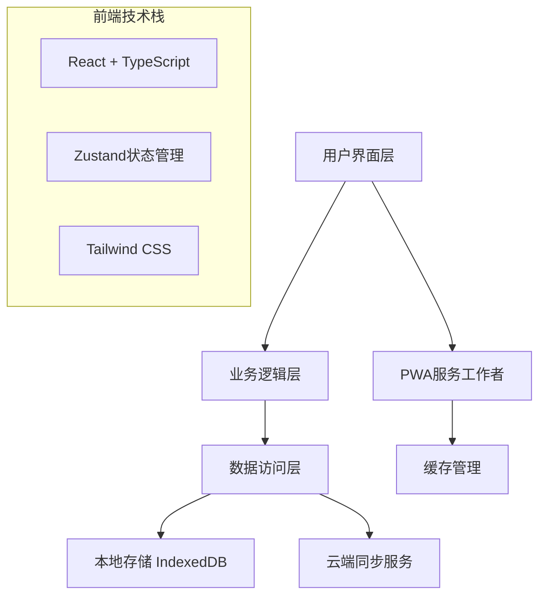

# GTD工具开发者文档

## 目录

1. [项目概述](#项目概述)
2. [技术架构](#技术架构)
3. [开发环境设置](#开发环境设置)
4. [项目结构](#项目结构)
5. [核心概念](#核心概念)
6. [API文档](#api文档)
7. [组件文档](#组件文档)
8. [状态管理](#状态管理)
9. [数据库设计](#数据库设计)
10. [测试指南](#测试指南)
11. [部署指南](#部署指南)
12. [贡献指南](#贡献指南)

## 项目概述

GTD工具是一个基于React和TypeScript的现代Web应用，实现了David Allen的Getting Things Done方法论。

### 核心特性

- 📝 任务收集和处理
- 🗂️ 情境化任务组织
- 📅 日程管理
- 🔍 全文搜索
- 📱 PWA支持
- 🔄 多设备同步
- 🌙 暗色主题
- ♿ 无障碍支持

### 技术栈

- **前端框架**: React 18 + TypeScript
- **状态管理**: Zustand
- **UI组件**: Tailwind CSS + Headless UI
- **本地存储**: IndexedDB (Dexie.js)
- **构建工具**: Vite
- **测试框架**: Vitest + React Testing Library
- **PWA**: Workbox

## 技术架构

### 整体架构



### 模块架构

```
src/
├── components/     # React组件
├── hooks/         # 自定义Hooks
├── store/         # 状态管理
├── database/      # 数据访问层
├── services/      # 业务服务
├── utils/         # 工具函数
├── types/         # TypeScript类型定义
└── contexts/      # React上下文
```

## 开发环境设置

### 系统要求

- Node.js 18+
- npm 9+
- 现代浏览器（Chrome 90+, Firefox 88+, Safari 14+）

### 安装步骤

1. **克隆仓库**
```bash
git clone https://github.com/your-org/gtd-tool.git
cd gtd-tool/gtd-app
```

2. **安装依赖**
```bash
npm install
```

3. **启动开发服务器**
```bash
npm run dev
```

4. **运行测试**
```bash
npm run test
```

### 开发工具配置

#### VS Code扩展推荐

```json
{
  "recommendations": [
    "bradlc.vscode-tailwindcss",
    "esbenp.prettier-vscode",
    "dbaeumer.vscode-eslint",
    "ms-vscode.vscode-typescript-next",
    "formulahendry.auto-rename-tag",
    "christian-kohler.path-intellisense"
  ]
}
```

#### ESLint配置

项目使用ESLint进行代码质量检查：

```javascript
// eslint.config.js
export default [
  {
    files: ['**/*.{js,jsx,ts,tsx}'],
    rules: {
      '@typescript-eslint/no-unused-vars': 'error',
      'react-hooks/exhaustive-deps': 'warn',
      'prefer-const': 'error'
    }
  }
];
```

## 项目结构

```
gtd-app/
├── public/                 # 静态资源
│   ├── sw.js              # Service Worker
│   ├── manifest.json      # PWA清单
│   └── icons/             # 应用图标
├── src/
│   ├── components/        # React组件
│   │   ├── capture/       # 收集功能组件
│   │   ├── process/       # 处理功能组件
│   │   ├── organize/      # 组织功能组件
│   │   ├── engage/        # 执行功能组件
│   │   ├── review/        # 回顾功能组件
│   │   ├── common/        # 通用组件
│   │   └── sync/          # 同步功能组件
│   ├── hooks/             # 自定义Hooks
│   │   ├── useGestures.ts # 手势支持
│   │   └── useKeyboardNavigation.ts # 键盘导航
│   ├── store/             # 状态管理
│   │   ├── gtd-store.ts   # 主要状态存储
│   │   └── types.ts       # 状态类型定义
│   ├── database/          # 数据访问层
│   │   ├── schema.ts      # 数据库模式
│   │   └── dao/           # 数据访问对象
│   ├── services/          # 业务服务
│   │   ├── sync-service.ts # 同步服务
│   │   └── conflict-resolver.ts # 冲突解决
│   ├── utils/             # 工具函数
│   │   ├── validation.ts  # 数据验证
│   │   ├── search-service.ts # 搜索服务
│   │   └── performance-monitor.ts # 性能监控
│   ├── types/             # TypeScript类型
│   │   ├── interfaces.ts  # 接口定义
│   │   ├── enums.ts       # 枚举定义
│   │   └── sync.ts        # 同步相关类型
│   └── contexts/          # React上下文
│       └── ThemeContext.tsx # 主题上下文
├── docs/                  # 文档
├── scripts/               # 构建脚本
├── tests/                 # 测试文件
└── config files           # 配置文件
```

## 核心概念

### 数据模型

#### InboxItem (工作篮项目)
```typescript
interface InboxItem {
  id: string;
  content: string;
  type: 'text' | 'voice' | 'image';
  createdAt: Date;
  processed: boolean;
}
```

#### Action (行动)
```typescript
interface Action {
  id: string;
  title: string;
  description?: string;
  contextId: string;
  projectId?: string;
  priority: Priority;
  estimatedTime?: number;
  dueDate?: Date;
  status: ActionStatus;
  createdAt: Date;
  updatedAt: Date;
  completedAt?: Date;
}
```

#### Project (项目)
```typescript
interface Project {
  id: string;
  title: string;
  description?: string;
  status: ProjectStatus;
  createdAt: Date;
  updatedAt: Date;
  completedAt?: Date;
}
```

#### Context (情境)
```typescript
interface Context {
  id: string;
  name: string;
  description?: string;
  color: string;
  icon?: string;
}
```

### 状态管理

使用Zustand进行状态管理，主要状态包括：

```typescript
interface GTDStore {
  // 数据状态
  inboxItems: InboxItem[];
  actions: Action[];
  projects: Project[];
  contexts: Context[];
  
  // UI状态
  currentView: ViewType;
  selectedItems: string[];
  filters: FilterCriteria;
  
  // 加载状态
  loading: boolean;
  error: string | null;
  
  // 操作方法
  addInboxItem: (item: Omit<InboxItem, 'id' | 'createdAt'>) => void;
  processInboxItem: (id: string, decision: ProcessDecision) => void;
  createAction: (action: Omit<Action, 'id' | 'createdAt' | 'updatedAt'>) => void;
  // ... 其他方法
}
```

## API文档

### 数据访问层API

#### InboxDAO

```typescript
class InboxDAO extends BaseDAO<InboxItem> {
  async getUnprocessed(): Promise<InboxItem[]>
  async markAsProcessed(id: string): Promise<void>
  async getByType(type: InputType): Promise<InboxItem[]>
}
```

#### ActionDAO

```typescript
class ActionDAO extends BaseDAO<Action> {
  async getByContext(contextId: string): Promise<Action[]>
  async getByProject(projectId: string): Promise<Action[]>
  async getByStatus(status: ActionStatus): Promise<Action[]>
  async getByDueDate(date: Date): Promise<Action[]>
  async search(query: string): Promise<Action[]>
}
```

#### ProjectDAO

```typescript
class ProjectDAO extends BaseDAO<Project> {
  async getByStatus(status: ProjectStatus): Promise<Project[]>
  async getWithActions(id: string): Promise<Project & { actions: Action[] }>
  async updateStatus(id: string, status: ProjectStatus): Promise<void>
}
```

#### ContextDAO

```typescript
class ContextDAO extends BaseDAO<Context> {
  async getWithActionCount(): Promise<(Context & { actionCount: number })[]>
  async getDefault(): Promise<Context[]>
}
```

### 服务层API

#### SearchService

```typescript
class SearchService {
  search(query: string, options?: SearchOptions): Promise<SearchResult[]>
  searchActions(query: string): Promise<Action[]>
  searchProjects(query: string): Promise<Project[]>
  createIndex(): Promise<void>
  updateIndex(items: any[]): Promise<void>
}
```

#### SyncService

```typescript
class SyncService {
  async sync(): Promise<SyncResult>
  async pushChanges(): Promise<void>
  async pullChanges(): Promise<void>
  async resolveConflicts(conflicts: Conflict[]): Promise<void>
  getStatus(): SyncStatus
}
```

## 组件文档

### 收集组件

#### QuickInput
快速输入组件，支持文本、语音和图片输入。

```typescript
interface QuickInputProps {
  onSubmit: (content: string, type: InputType) => void;
  placeholder?: string;
  autoFocus?: boolean;
}
```

**使用示例**:
```tsx
<QuickInput
  onSubmit={(content, type) => addInboxItem({ content, type })}
  placeholder="记录您的想法..."
  autoFocus
/>
```

#### InboxList
工作篮列表组件，显示未处理的项目。

```typescript
interface InboxListProps {
  items: InboxItem[];
  onProcess: (id: string) => void;
  onDelete: (id: string) => void;
  selectedItems?: string[];
  onSelectionChange?: (ids: string[]) => void;
}
```

### 处理组件

#### ProcessingWizard
处理向导组件，引导用户完成GTD处理流程。

```typescript
interface ProcessingWizardProps {
  item: InboxItem;
  onComplete: (decision: ProcessDecision) => void;
  onCancel: () => void;
}
```

### 组织组件

#### ContextManager
情境管理组件，用于创建和管理情境。

```typescript
interface ContextManagerProps {
  contexts: Context[];
  onAdd: (context: Omit<Context, 'id'>) => void;
  onUpdate: (id: string, updates: Partial<Context>) => void;
  onDelete: (id: string) => void;
}
```

#### ProjectManager
项目管理组件，用于创建和管理项目。

```typescript
interface ProjectManagerProps {
  projects: Project[];
  actions: Action[];
  onCreateProject: (project: Omit<Project, 'id' | 'createdAt' | 'updatedAt'>) => void;
  onUpdateProject: (id: string, updates: Partial<Project>) => void;
  onDeleteProject: (id: string) => void;
}
```

### 执行组件

#### TodayView
今日任务视图组件。

```typescript
interface TodayViewProps {
  actions: Action[];
  onComplete: (id: string) => void;
  onEdit: (id: string, updates: Partial<Action>) => void;
  onReschedule: (id: string, newDate: Date) => void;
}
```

#### ActionFilters
任务过滤器组件。

```typescript
interface ActionFiltersProps {
  contexts: Context[];
  projects: Project[];
  currentFilters: FilterCriteria;
  onFiltersChange: (filters: FilterCriteria) => void;
}
```

### 通用组件

#### ErrorBoundary
错误边界组件，捕获和处理React错误。

```typescript
interface ErrorBoundaryProps {
  children: React.ReactNode;
  fallback?: React.ComponentType<{ error: Error }>;
  onError?: (error: Error, errorInfo: ErrorInfo) => void;
}
```

#### VirtualScrollList
虚拟滚动列表组件，用于大量数据的性能优化。

```typescript
interface VirtualScrollListProps<T> {
  items: T[];
  itemHeight: number;
  renderItem: (item: T, index: number) => React.ReactNode;
  containerHeight: number;
  overscan?: number;
}
```

## 状态管理

### Zustand Store结构

```typescript
// store/gtd-store.ts
export const useGTDStore = create<GTDStore>((set, get) => ({
  // 初始状态
  inboxItems: [],
  actions: [],
  projects: [],
  contexts: [],
  
  // 收集操作
  addInboxItem: (item) => {
    const newItem: InboxItem = {
      ...item,
      id: generateId(),
      createdAt: new Date(),
      processed: false,
    };
    set((state) => ({
      inboxItems: [...state.inboxItems, newItem]
    }));
  },
  
  // 处理操作
  processInboxItem: async (id, decision) => {
    const item = get().inboxItems.find(i => i.id === id);
    if (!item) return;
    
    // 根据决策创建相应的实体
    switch (decision.actionType) {
      case 'do':
        // 创建立即执行的任务
        break;
      case 'defer':
        // 创建延迟任务
        break;
      case 'delegate':
        // 创建委派任务
        break;
      // ... 其他情况
    }
    
    // 标记为已处理
    set((state) => ({
      inboxItems: state.inboxItems.map(i =>
        i.id === id ? { ...i, processed: true } : i
      )
    }));
  },
}));
```

### 状态持久化

```typescript
// 使用Zustand的persist中间件
export const useGTDStore = create<GTDStore>()(
  persist(
    (set, get) => ({
      // store实现
    }),
    {
      name: 'gtd-store',
      storage: createJSONStorage(() => localStorage),
      partialize: (state) => ({
        // 只持久化必要的状态
        contexts: state.contexts,
        projects: state.projects,
        // 不持久化临时状态
      }),
    }
  )
);
```

## 数据库设计

### IndexedDB Schema

```typescript
// database/schema.ts
export const dbSchema = {
  version: 1,
  stores: {
    inboxItems: {
      keyPath: 'id',
      indexes: {
        createdAt: 'createdAt',
        processed: 'processed',
        type: 'type',
      }
    },
    actions: {
      keyPath: 'id',
      indexes: {
        contextId: 'contextId',
        projectId: 'projectId',
        status: 'status',
        dueDate: 'dueDate',
        priority: 'priority',
        createdAt: 'createdAt',
      }
    },
    projects: {
      keyPath: 'id',
      indexes: {
        status: 'status',
        createdAt: 'createdAt',
        updatedAt: 'updatedAt',
      }
    },
    contexts: {
      keyPath: 'id',
      indexes: {
        name: 'name',
      }
    }
  }
};
```

### 数据迁移

```typescript
// database/migrations.ts
export const migrations = {
  1: (db: IDBDatabase) => {
    // 初始化数据库结构
  },
  2: (db: IDBDatabase) => {
    // 添加新字段或索引
  },
  // ... 更多版本
};
```

## 测试指南

### 测试结构

```
src/
├── components/
│   └── __tests__/          # 组件测试
├── hooks/
│   └── __tests__/          # Hook测试
├── utils/
│   └── __tests__/          # 工具函数测试
├── services/
│   └── __tests__/          # 服务测试
└── test/
    ├── setup.ts            # 测试设置
    ├── mocks/              # 模拟对象
    └── fixtures/           # 测试数据
```

### 测试类型

#### 单元测试
```typescript
// components/__tests__/QuickInput.test.tsx
import { render, screen, fireEvent } from '@testing-library/react';
import { QuickInput } from '../QuickInput';

describe('QuickInput', () => {
  it('should call onSubmit when form is submitted', () => {
    const mockSubmit = vi.fn();
    render(<QuickInput onSubmit={mockSubmit} />);
    
    const input = screen.getByPlaceholderText('记录您的想法...');
    fireEvent.change(input, { target: { value: '测试任务' } });
    fireEvent.submit(input.closest('form')!);
    
    expect(mockSubmit).toHaveBeenCalledWith('测试任务', 'text');
  });
});
```

#### 集成测试
```typescript
// components/__tests__/ProcessingWizard.integration.test.tsx
describe('ProcessingWizard Integration', () => {
  it('should complete full processing workflow', async () => {
    const mockComplete = vi.fn();
    const testItem: InboxItem = {
      id: '1',
      content: '准备会议材料',
      type: 'text',
      createdAt: new Date(),
      processed: false,
    };
    
    render(<ProcessingWizard item={testItem} onComplete={mockComplete} />);
    
    // 模拟完整的处理流程
    // 1. 确认需要行动
    fireEvent.click(screen.getByText('需要行动'));
    
    // 2. 选择延迟处理
    fireEvent.click(screen.getByText('延迟处理'));
    
    // 3. 设置情境
    fireEvent.click(screen.getByText('办公室'));
    
    // 4. 完成处理
    fireEvent.click(screen.getByText('完成'));
    
    expect(mockComplete).toHaveBeenCalledWith({
      isActionable: true,
      actionType: 'defer',
      context: '办公室',
    });
  });
});
```

#### E2E测试
```typescript
// e2e/gtd-workflow.test.ts
import { test, expect } from '@playwright/test';

test('complete GTD workflow', async ({ page }) => {
  await page.goto('/');
  
  // 1. 收集
  await page.fill('[data-testid="quick-input"]', '准备会议材料');
  await page.click('[data-testid="submit-button"]');
  
  // 2. 处理
  await page.click('[data-testid="process-tab"]');
  await page.click('[data-testid="process-first-item"]');
  
  // 3. 决策流程
  await page.click('[data-testid="actionable-yes"]');
  await page.click('[data-testid="defer-action"]');
  await page.click('[data-testid="context-office"]');
  await page.click('[data-testid="complete-processing"]');
  
  // 4. 验证结果
  await page.click('[data-testid="engage-tab"]');
  await expect(page.locator('[data-testid="action-item"]')).toContainText('准备会议材料');
});
```

### 测试工具配置

#### Vitest配置
```typescript
// vite.config.ts
export default defineConfig({
  test: {
    globals: true,
    environment: 'jsdom',
    setupFiles: './src/test/setup.ts',
    coverage: {
      provider: 'v8',
      reporter: ['text', 'json', 'html'],
      exclude: [
        'node_modules/',
        'src/test/',
        '**/*.d.ts',
        '**/*.test.{ts,tsx}',
      ],
    },
  },
});
```

#### 测试设置
```typescript
// src/test/setup.ts
import '@testing-library/jest-dom';
import { vi } from 'vitest';

// 模拟IndexedDB
global.indexedDB = {
  open: vi.fn(),
  deleteDatabase: vi.fn(),
  databases: vi.fn(),
};

// 模拟Service Worker
Object.defineProperty(navigator, 'serviceWorker', {
  value: {
    register: vi.fn(),
    ready: Promise.resolve({
      unregister: vi.fn(),
    }),
  },
});
```

## 部署指南

### 构建配置

#### 开发构建
```bash
npm run dev
```

#### 生产构建
```bash
npm run build:production
```

#### 构建分析
```bash
npm run build:analyze
```

### 部署选项

#### 静态托管 (Netlify/Vercel)
```bash
# 使用部署脚本
npm run deploy:production

# 或手动部署
npm run build
# 上传dist目录到托管服务
```

#### Docker部署
```bash
# 构建镜像
docker build -t gtd-tool .

# 运行容器
docker run -p 8080:8080 gtd-tool
```

#### Docker Compose
```bash
# 启动所有服务
docker-compose up -d

# 仅启动应用
docker-compose up gtd-app
```

### 环境配置

#### 生产环境变量
```bash
# .env.production
VITE_APP_TITLE=GTD工具
VITE_API_BASE_URL=https://api.gtd-tool.com
VITE_ENABLE_ANALYTICS=true
VITE_ENABLE_ERROR_REPORTING=true
```

#### 安全配置
- CSP策略配置
- HTTPS强制
- 安全头设置
- 敏感信息保护

### 监控和日志

#### 性能监控
```typescript
// utils/performance-monitor.ts
export class PerformanceMonitor {
  static trackPageLoad() {
    // 页面加载性能监控
  }
  
  static trackUserInteraction(action: string) {
    // 用户交互监控
  }
  
  static trackError(error: Error) {
    // 错误监控
  }
}
```

#### 错误报告
```typescript
// utils/error-reporter.ts
export class ErrorReporter {
  static report(error: Error, context?: any) {
    if (import.meta.env.VITE_ENABLE_ERROR_REPORTING === 'true') {
      // 发送错误报告到监控服务
    }
  }
}
```

## 贡献指南

### 开发流程

1. **Fork仓库**
2. **创建功能分支**
   ```bash
   git checkout -b feature/new-feature
   ```
3. **开发和测试**
   ```bash
   npm run test
   npm run lint
   ```
4. **提交代码**
   ```bash
   git commit -m "feat: add new feature"
   ```
5. **推送分支**
   ```bash
   git push origin feature/new-feature
   ```
6. **创建Pull Request**

### 代码规范

#### 提交信息规范
```
type(scope): description

feat: 新功能
fix: 修复bug
docs: 文档更新
style: 代码格式调整
refactor: 代码重构
test: 测试相关
chore: 构建或工具相关
```

#### 代码风格
- 使用TypeScript严格模式
- 遵循ESLint规则
- 使用Prettier格式化
- 组件使用函数式组件和Hooks
- 优先使用组合而非继承

#### 文档要求
- 新功能需要添加文档
- 复杂函数需要JSDoc注释
- 组件需要Props接口文档
- API变更需要更新文档

### 测试要求

- 新功能必须有单元测试
- 覆盖率不低于80%
- 关键路径需要集成测试
- UI组件需要可访问性测试

### 性能要求

- 首屏加载时间 < 3秒
- 交互响应时间 < 100ms
- 内存使用合理
- 支持大量数据（10000+项目）

---

## 常见问题

### Q: 如何添加新的情境类型？
A: 在`types/enums.ts`中添加新的枚举值，然后在`utils/context-templates.ts`中添加模板。

### Q: 如何扩展搜索功能？
A: 修改`services/search-service.ts`，添加新的搜索字段和权重配置。

### Q: 如何添加新的同步提供商？
A: 实现`SyncProvider`接口，然后在`services/sync-service.ts`中注册。

### Q: 如何优化大量数据的性能？
A: 使用虚拟滚动、分页加载、索引优化等技术。

### Q: 如何添加新的主题？
A: 在`contexts/ThemeContext.tsx`中添加主题配置，更新CSS变量。

---

## 联系方式

- 项目仓库: https://github.com/your-org/gtd-tool
- 问题反馈: https://github.com/your-org/gtd-tool/issues
- 文档网站: https://gtd-tool-docs.netlify.app
- 邮箱: dev@gtd-tool.com

感谢您对GTD工具的贡献！